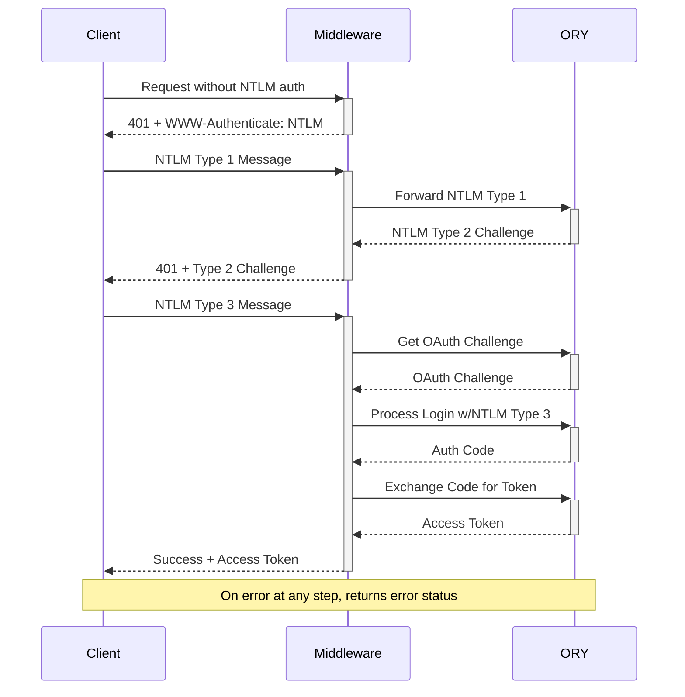

# ntlm-sso-ory

A framework-agnostic NTLM authentication helper for ORY identity servers.

## How it Works

The package handles the complete NTLM SSO authentication flow between your client, middleware, and ORY server:



The flow consists of three main phases:

1. NTLM Challenge-Response: Initial NTLM handshake and challenge
2. OAuth Integration: Converting successful NTLM authentication into OAuth flow
3. Token Exchange: Final access token generation and delivery

## Installation

```bash
npm install ntlm-sso-ory
```

## Usage

The package exports a single function `handleNtlmAuth` that manages the NTLM authentication flow with an ORY server. It can be used with any framework or vanilla Node.js application.

```typescript
import {handleNtlmAuth, extractCookieDetails, getUserDetails} from "ntlm-sso-ory";

// Configuration
const config = {
    clientId: "your-client-id",
    issuerUrl: "https://your-ory-server.com/",
    debug: false, //optional, defaults to false
};

// Example usage with Express
app.use(async (req, res, next) => {
    const result = await handleNtlmAuth(req.headers, config, config.debug);

    if (result.status === "challenge") {
        //We need to implement the NTLMSESSIOn cookie from the result to identify type 1 -> type 3 on server
        const cookie = extractCookieDetails(result.cookie);
        if (cookie) {
            res.cookie(cookie.name, cookie.value, {
                httpOnly: true,
                //secure: true,
                //sameSite: 'Strict',
                maxAge: cookie.maxAge, // 1 minute
            });
        }
        // Send NTLM challenge back to client
        res.set(result.headers);
        res.status(401).send();
        return;
    }

    if (result.status === "error") {
        res.status(401).send(result.error);
        return;
    }

    //Obtain User from Token - Optional
    const user = await getUserDetails(config.issuerUrl, result.token, false)
    //Set User session
    req.user = user;
    // Authentication successful
    req.token = result.token;
    next();
});

// Example usage with Fastify
app.addHook("preHandler", async (request, reply) => {
    const result = await handleNtlmAuth(request.headers, config, config.debug);

    if (result.status === "challenge") {
        reply.headers(result.headers);
        reply.code(401).send();
        return;
    }

    if (result.status === "error") {
        reply.code(401).send(result.error);
        return;
    }

    request.token = result.token;
});
```

## API

### handleNtlmAuth(headers, config)

Handles the NTLM authentication flow with an ORY server.

#### Parameters

-   `headers` - Object containing HTTP headers from the request
-   `config` - Configuration object with:
    -   `clientId` - ORY client ID
    -   `issuerUrl` - Base URL of the ORY server

#### Returns

Promise resolving to an object with:

-   `status` - One of: 'challenge' | 'success' | 'error'
-   `headers?` - Response headers for NTLM challenges
-   `token?` - Access token on successful authentication
-   `error?` - Error message if authentication fails

## License

MIT
